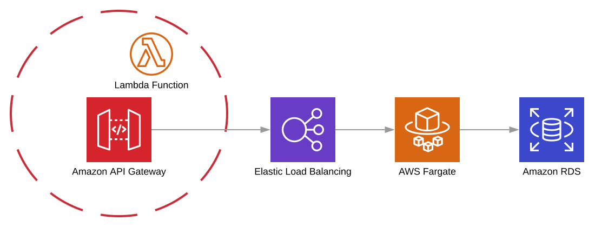

# API Gateway Patterns

{ align=left  }
> Different patterns of architecture for API Gateway
---

## API Gateway with Fargate

Esse incididunt ipsum sunt veniam velit nulla. Laboris tempor ut laboris elit. Id qui dolor duis nostrud labore do quis non do cupidatat quis sunt irure ullamco. Mollit ullamco ad enim commodo. Laboris qui ad nisi amet proident consequat non sunt deserunt occaecat. Incididunt excepteur sunt dolore consequat dolore occaecat cupidatat ad aliqua nostrud in proident adipisicing.

## Private/Internal to be called by Datacenter

## API Gateway Public Endpoint
