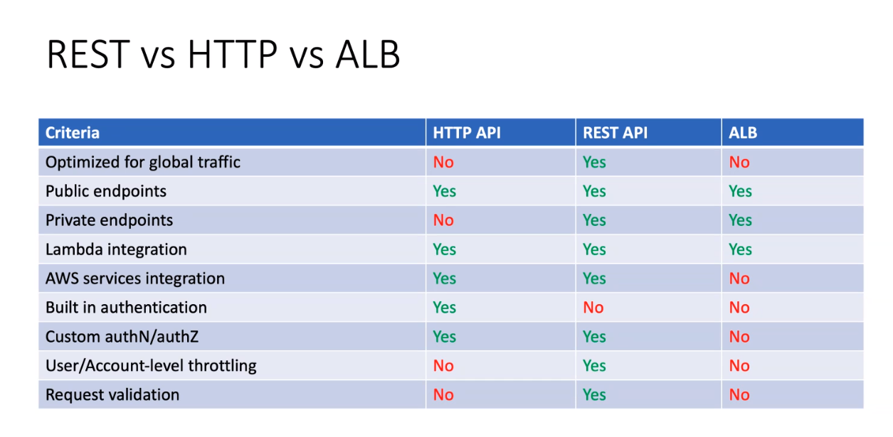

# API-Gateway

{ align=left  }
> API Gateways are often used as an accespoint   or endpoint for other AWS services.

---

## API Options

=== "Public (Regional)"

    * Basic API-Gateway with Rest Lambda
    * API-Gateway with Authorization Lambda
    * Nulla tempor lobortis orci

=== "Private"

    1. Sed sagittis eleifend rutrum
    2. Donec vitae suscipit est
    3. Nulla tempor lobortis orci

=== "Edge Optimized"

    ==Edge Optimized  (via CloudFront)==

    1. Sed sagittis eleifend rutrum
    2. Donec vitae suscipit est
    3. Nulla tempor lobortis orci

=== "WebSocket API"

    1. Sed sagittis eleifend rutrum
    2. Donec vitae suscipit est
    3. Nulla tempor lobortis orci

=== "Load Balancer"

    1. Sed sagittis eleifend rutrum
    2. Donec vitae suscipit est
    3. Nulla tempor lobortis orci

## API Features

1. Develop
   
    1. Routes
    2. Authorization
    3. CORS

2. Deploy
3. Protect
4. Monitor

## Which API Type

{ align=left }

!!! abstract "API Cost Calculator"
    [Fargate Cost Calculator](https://calculator.aws/#/createCalculator/APIGateway) - <https://calculator.aws/#/createCalculator/APIGateway>

### Cost

!!! note "Cost Context"
     HTTP API is about 70% cheaper than API Gateway REST APIs

### Resilency

Do you need Fargate in Multi-AZ?

## When Private API is better

1. Cost-sensitivity
2. Spoardic workloads
3. Processing batches takes less than 15 minutes

!!! warning "Caching"
    it can reduce the invocations of a Lambda function or other API Gateway end-target.

### Example Usage

For example you could rearchitect your react app (front-end) to work within a lambda
The lambda could then call a CMS content api (back-end)
Your remaining static assets could live on a S3 bucket.

This architect is highly scaleable, cost-effective.
The challenge: it may require significant rearchitecture from your current solution.

## When Public API is better

In Lorem anim Lorem dolor. Laboris tempor quis eiusmod quis quis eiusmod dolore dolore id. Ea do aliquip id fugiat sunt ex magna est eu. Anim aute eu elit nostrud velit. Anim qui dolore anim esse.

## API Considerations

Aliqua commodo ex consectetur Lorem Lorem enim incididunt aliquip reprehenderit cillum quis irure laborum. Eiusmod deserunt occaecat tempor mollit Lorem reprehenderit. Cillum ullamco nostrud culpa consequat esse ut officia mollit laborum tempor proident pariatur. Qui veniam qui sunt in aliquip minim aute elit amet excepteur cupidatat proident reprehenderit. Id in amet pariatur laborum non tempor consectetur tempor tempor.

Non enim pariatur eu ad veniam fugiat occaecat elit ipsum ea. Deserunt ea sit nostrud aliqua ipsum eiusmod officia in dolore laborum deserunt. Labore ut nostrud nisi consequat esse commodo id do labore proident. Dolore amet id Lorem commodo ullamco et magna quis.

### Dependencies

Voluptate et exercitation ipsum sint minim excepteur irure occaecat sunt in incididunt. Ipsum officia aute pariatur non reprehenderit. Elit non irure dolor sit ea duis magna nisi. Nisi aute irure fugiat excepteur pariatur anim non sunt est sint pariatur ipsum culpa fugiat. Exercitation nostrud laborum quis ipsum incididunt.

### Throttling

A throttling threshold is (a combination of)

1. the number of **calls per second**
2. the number of **allowed bursts**.

!!! note "Environment"
     It is recommended to use this feature to avoid bursting your budget in a **development environment.**  
     As for **production environments**, this feature may be risky, as you can create a denial of service for legit requests.

### Do you need Chargeback for your API?

## How to implement

## References

[3 API Gateway Features](https://medium.com/devtechblogs/three-aws-api-gateway-features-to-manage-and-control-the-invocations-of-its-targets-32af562696b9#:~:text=The%20API%20Gateway%20throttles%20requests%20using%20the%20token,bucket%E2%80%99s%20capacity%20is%20measured%20every%20specific%20time%20frame.)
