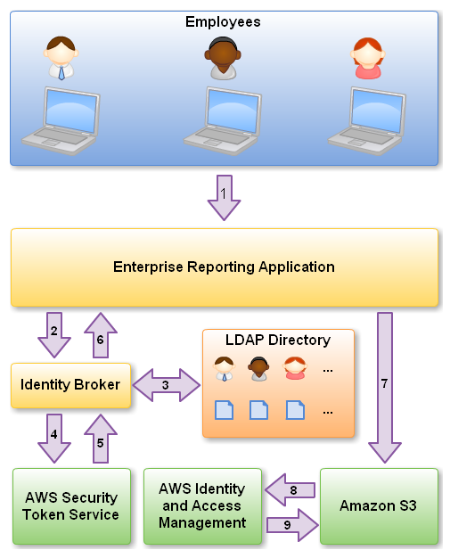

# On-Premise and AWS (WHy?)

## Ways to Integrate (What?)

1. SAML 2.0
2. STS (AWS Security Token Service)
3. or a custom Identity broker (i.e. OKTA)

# How it Works

## Reference

[Identity Federation](https://aws.amazon.com/blogs/aws/aws-identity-and-access-management-now-with-identity-federation/)
[OKTA](https://www.okta.com/aws/)

## Key Terms

abc