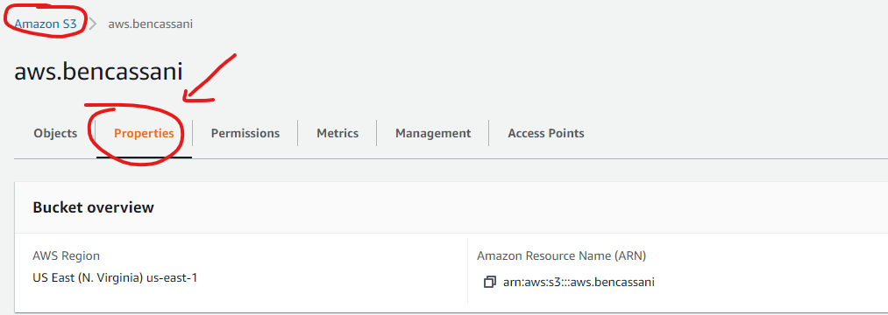
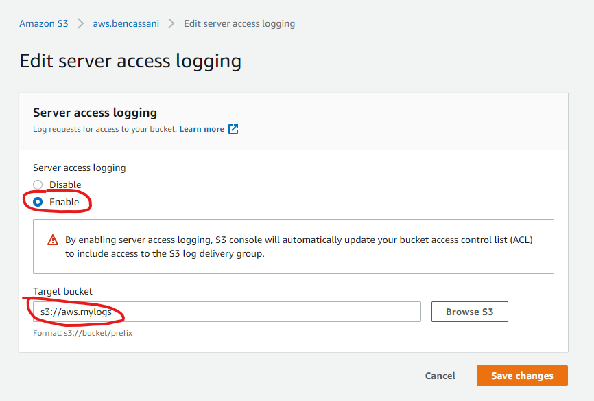

# S3 - Simple Storage Service

## Why?

## What?

## How?

## Defaults

* S3 objects are `PRIVATE` by default
  * They are not public to the world unless configured so

## Pricing

## Constraints

## Compliance & Security

> Q: Do you need to log S3 changes and access?

### Logging Options

1. CloudTrail
2. S3 Server Access Logging

> Q: How detailed do you need your logging?

1. For **more detailed** logging you the Server Access logging feature.

!!! info "Target Bucket"
    for simplicity select another S3 bucket just for logging

!!! warning "Server Access Logging"
    Server access logging isn't guaranteed to capture everything
    Usually they are delivered in a few hours.

### Best effort server log delivery

Server access log records are delivered on a best effort basis. Most requests...result in a delivered log record. Most log records are delivered within a few hours of the time that they are recorded, but they can be delivered more frequently.

The completeness and timeliness of server logging is not guaranteed. The log record for a particular request might be delivered long after the request was actually processed, or it might not be delivered at all. The **purpose** of server logs is to give you an idea of the nature of traffic against your bucket. It is rare to lose log records, but server logging is not meant to be a complete accounting of all requests.
